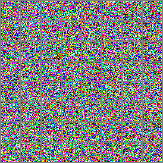

# Image generation models
Joint work with Zuzanna Kotlińska on the Image generation project as part of the Deep Learning course at Warsaw University of Technology.

## Dataset

The data  is 20% sample of popular LSUN1 with a focus on *bedroom* category and contains images of this category.
Dataset is availble on Kaggle under this [link](https://www.kaggle.com/datasets/eclaircat/cinic-eclair-test?resource=download).

## Task

The project’s objective is image generation with GAN and Diffusion models. The task is to
implement models which will recreate the scenery of the given data observations

## Instruction
Install all necessary libraries, specified in *requirements.txt*.

To obtain the results, simply run one of the following Python scripts:
* `python src/ddpm/main.py` - specify config values in `config.py`, especially training, and run the script to train and evaluate Diffusion model.
* `python src/gan/run_experiments.ipynb` - run the notebook to train and evaluate Generative Adversarial Network Model.

## Results

As a probe of models capabilities, we present the animated process of image generation (here by diffuser):

